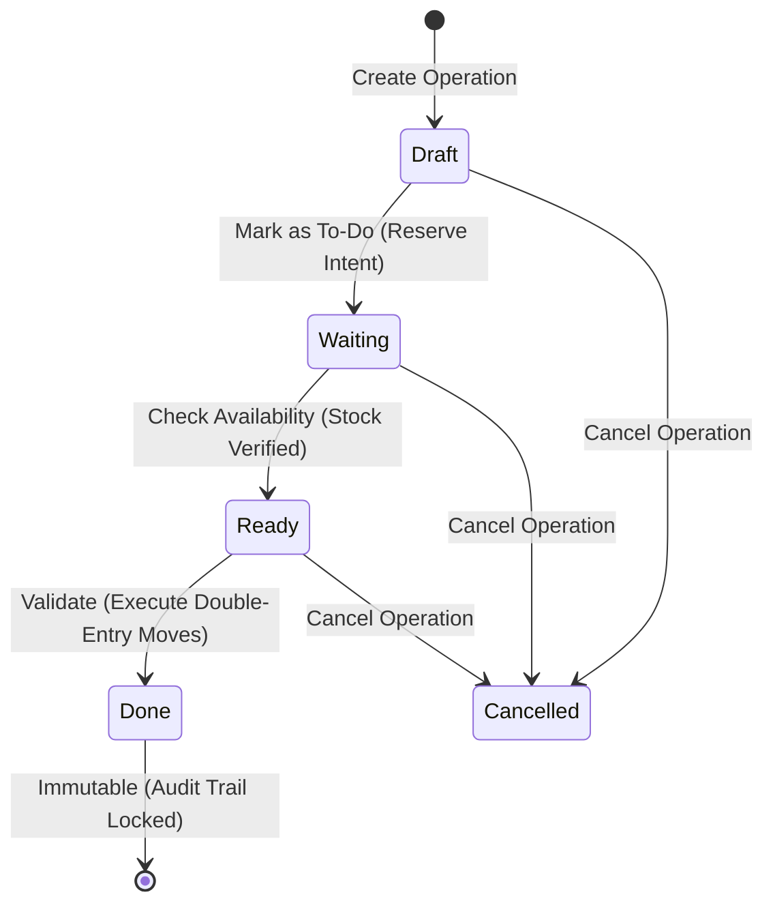
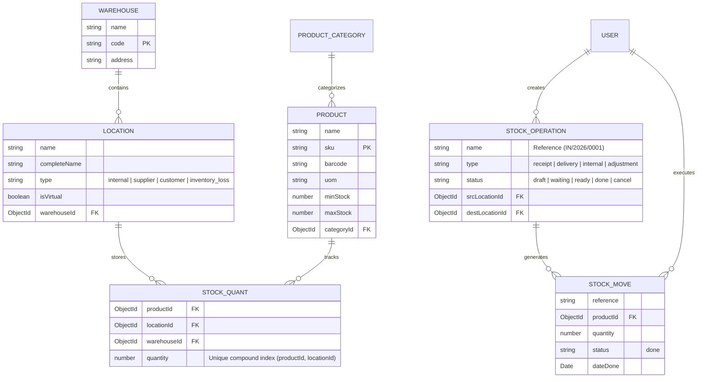

<div align="center">

# 📦 StockSense — Enterprise Inventory Engine
### *Next-Generation Odoo-Inspired Double-Entry Inventory Ledger & Warehouse Management System*

[-007acc?style=for-the-badge&logo=react&logoColor=61dafb)](https://github.com/aspirant-22/StockSense_OdooHack)
[](https://vitejs.dev/)
[](https://tailwindcss.com/)
[](https://www.mongodb.com/)
[](LICENSE)

<p align="center">
  <a href="#-key-features">Key Features</a> •
  <a href="#-architecture--mechanics">Architecture</a> •
  <a href="#-database-design--ledger-rules">Database Design</a> •
  <a href="#-getting-started">Getting Started</a> •
  <a href="#-api-documentation">API Reference</a> •
  <a href="#-demo-scenarios">Demo Scenarios</a>
</p>

</div>

---

## 📑 Table of Contents
1. [🌟 Executive Overview](#-executive-overview)
2. [📐 Core Architecture & Odoo-Style Mechanics](#-architecture--mechanics)
   - [The Double-Entry Inventory Principle](#the-double-entry-inventory-principle)
   - [Location Classification Matrix](#location-classification-matrix)
   - [State Lifecycle Workflow](#state-lifecycle-workflow)
3. [✨ Key Features & Modules](#-key-features)
4. [🛠️ Technology Stack](#️-technology-stack)
5. [🗄️ Database Schema & Compound Indexing](#️-database-schema--compound-indexing)
6. [📂 Repository Structure](#-repository-structure)
7. [🚀 Quick Start & Installation](#-getting-started)
   - [Prerequisites](#prerequisites)
   - [Installation Steps](#step-by-step-installation)
   - [Environment Configuration](#environment-variables)
   - [Database Seeding & Test Credentials](#database-seeding--demo-accounts)
   - [Running the Application](#running-the-development-servers)
8. [📡 REST API Reference](#-api-documentation)
9. [🧪 End-to-End Walkthrough & Test Scenarios](#-demo-scenarios)
10. [🛡️ Reliability & Data Integrity Guarantees](#️-reliability--data-integrity-guarantees)
11. [🔮 Roadmap](#-roadmap)
12. [🤝 Contributing & License](#-contributing--license)

---

## 🌟 Executive Overview

Traditional inventory management tools operate on crude, destructive database updates (e.g., executing `quantity = quantity - 5`). This approach creates phantom inventory, introduces race conditions, and eliminates historical accountability.

**StockSense** solves this by implementing the battle-tested **Double-Entry Inventory Engine** pioneered by **Odoo**. 

### 💡 The Core Philosophy:
> **"Stock is never created or destroyed; it is only transferred from a Source Location to a Destination Location."**

Every inventory action—receiving purchase orders, staging materials, fulfilling customer sales, or adjusting for warehouse shrinkage—is tracked as an **immutable, double-entry stock movement record**.

```
                           ┌──────────────────────────────────────────────┐
                           │            STOCKSENSE CORE ENGINE            │
                           └──────────────────────┬───────────────────────┘
                                                  │
                 ┌────────────────────────────────┴────────────────────────────────┐
                 ▼                                                                 ▼
   ┌───────────────────────────┐                                     ┌───────────────────────────┐
   │      SOURCE LOCATION      │                                     │   DESTINATION LOCATION    │
   │ (Vendor / Internal / Loss)│                                     │ (Internal / Customer/Loss)│
   └─────────────┬─────────────┘                                     └─────────────┬─────────────┘
                 │                                                                 │
                 │   [ - Quantity if Internal ]                                    │   [ + Quantity if Internal ]
                 └────────────────────────────────┬────────────────────────────────┘
                                                  │
                                                  ▼
                               ┌─────────────────────────────────────┐
                               │   IMMUTABLE AUDIT STOCK MOVE ROW    │
                               │  (SKU, Qty, Ref, User, Timestamps)  │
                               └─────────────────────────────────────┘
```

---

## 📐 Architecture & Mechanics

### The Double-Entry Inventory Principle

In StockSense, inventory balances are represented as **Stock Quants** (`StockQuant`), uniquely mapped to a specific `(Product, Location)` coordinate. When a transaction is validated:
1. **Source Internal Location**: Balance is verified for sufficient on-hand availability and atomically decremented (`-$inc`).
2. **Destination Internal Location**: Balance is atomically incremented (`+$inc`).
3. **Virtual Locations** (Vendors, Customers, Scrap/Loss): Act as conceptual sinks/sources, ensuring balanced ledgers without constraining real stock calculations.
4. **Audit Ledger**: A permanent, unmodifiable `StockMove` log entry is appended with user attribution, timestamp, and transaction reference.

---

### Location Classification Matrix

| Operation Category | Source Location Type | Destination Location Type | Physical Quant Effect |
| :--- | :--- | :--- | :--- |
| **Incoming Receipt** | Virtual Vendor (`supplier`) | Physical Internal (`internal`) | `+` Increases destination location quant |
| **Delivery Order** | Physical Internal (`internal`) | Virtual Customer (`customer`) | `-` Decreases source location quant (Availability strictly validated) |
| **Internal Transfer** | Physical Internal (`internal`) | Physical Internal (`internal`) | `-` Decreases source quant / `+` Increases destination quant |
| **Stock Adjustment (Gain)** | Virtual Loss/Gain (`inventory_loss`) | Physical Internal (`internal`) | `+` Increases destination quant |
| **Stock Adjustment (Loss)** | Physical Internal (`internal`) | Virtual Loss/Gain (`inventory_loss`) | `-` Decreases source quant |

---

### State Lifecycle Workflow

Every stock operation moves through an explicit, auditable state machine:



1. **Draft**: Initial configuration; items, quantities, and locations can be modified freely.
2. **Waiting (To Do)**: Operational intent confirmed; queued for warehouse staff.
3. **Ready (Assigned)**: Real-time stock verification confirms all requested SKUs are available in source racks.
4. **Done (Validated)**: Stock moves execute atomically; quants update, and ledger entries lock permanently.
5. **Cancelled**: Transaction is aborted with no impact on physical stock.

---

## ✨ Key Features

### 📊 1. Real-Time Operational Dashboard
- **KPI Metrics Cards**: Total active SKUs, Low Stock alerts, Pending Receipts, Pending Deliveries, and Internal Transfers.
- **Warehouse Isolation Filter**: Dynamically filter operational metrics by individual warehouse or view corporate-wide rollups.
- **Quick Action Triggers**: 1-click launchers for initiating Receipts, Deliveries, Transfers, and Physical Count Adjustments.

### 📥 2. Incoming Receipts (Procurement & Inbound Logistics)
- Create vendor receipts with automated sequential reference numbering (e.g., `IN/2026/0001`).
- Multi-line SKU batching with automatic unit-of-measure synchronization.
- Real-time quant increases upon warehouse manager validation.

### 📤 3. Delivery Orders (Outbound Dispatch & Fulfillment)
- Fulfill customer purchase orders with built-in **Stock Availability Checks**.
- Prevents stockouts by blocking dispatches when internal source locations lack sufficient on-hand quantities.
- Generates outbound tracking references (e.g., `OUT/2026/0001`).

### 🔄 4. Internal Warehouse Transfers
- Seamlessly route goods between aisles, racks, production zones, or distinct physical warehouse facilities (e.g., `WH/Stock` ➔ `WH/Production-A`).
- Maintains continuous chain of custody across all internal logistics steps.

### ⚖️ 5. Inventory Adjustments & Physical Count Reconciliation
- Audit physical warehouse counts against system ledger figures.
- Automatically calculates variance deltas and generates compensating double-entry moves against virtual loss locations.

### 📜 6. Immutable Double-Entry Stock Move Ledger
- Complete searchable and filterable history of every inventory transaction.
- Trace exact SKU, quantity, source node, destination node, user attribution, and execution timestamp.

### 🏷️ 7. Product Catalog & Automated Reordering Alerts
- Comprehensive SKU management: Categorization, Barcodes, Cost/Sale Pricing, and custom UOMs (Units, Kg, Box, Liters).
- Configurable **Minimum/Maximum Reorder Thresholds** triggering dynamic low-stock status badges.

### 🏢 8. Multi-Warehouse & Hierarchical Location Tree
- Multi-facility configuration with dedicated warehouse codes and physical addresses.
- Unlimited sub-location nesting (Warehouse ➔ Stock ➔ Aisle ➔ Shelf/Rack).

### 🔐 9. Dual-Tier Role-Based Access Control (RBAC) & Security
- Granular permissions for **Inventory Lead (Manager)** and **Warehouse Operator (Staff)**.
- JWT-based authentication with protected Express middleware.
- Secure password reset workflow with OTP email integration.

---

## 🛠️ Technology Stack

<div align="center">

| Layer | Technologies | Description |
| :--- | :--- | :--- |
| **Frontend UI** | **React 19**, **Vite 8** | High-performance SPA with modern React hooks & fast HMR |
| **Styling & Icons** | **Tailwind CSS v4**, **Lucide React** | Responsive, modern dark/light glassmorphic interface |
| **Backend Runtime** | **Node.js 18+**, **Express.js 4** | Robust REST API server with structured MVC + Service layer |
| **Database & ODM** | **MongoDB 8.0**, **Mongoose 8** | High-throughput document store with compound indexes |
| **Validation & Security** | **Zod 3**, **JWT**, **Bcrypt.js** | Strict schema validation, password hashing, stateless tokens |
| **Email Service** | **Nodemailer** | Transporter for OTP password recovery and system alerts |

</div>

---

## 🗄️ Database Schema & Compound Indexing

StockSense optimizes query performance and enforces absolute consistency through MongoDB compound indexing:



> **⚡ Performance Note:** The `StockQuant` collection enforces a unique compound index on `{ productId: 1, locationId: 1 }`. This guarantees that each SKU has exactly one authoritative inventory counter per location, eliminating duplicate records and race conditions.

---

## 📂 Repository Structure

```
StockSense/
├── backend/
│   ├── config/
│   │   └── db.js                 # MongoDB connection & pool configuration
│   ├── controllers/
│   │   ├── auth.controller.js       # User signup, login, OTP recovery
│   │   ├── dashboard.controller.js  # Analytics, low stock & KPI counts
│   │   ├── operation.controller.js  # Multi-state operations & movements
│   │   ├── product.controller.js    # SKU catalog, categories, reorder rules
│   │   └── warehouse.controller.js  # Facilities & hierarchical location trees
│   ├── middleware/
│   │   ├── auth.middleware.js       # JWT extraction & role authorization
│   │   ├── error.middleware.js      # Global error formatters & 404 handler
│   │   └── validate.middleware.js   # Zod request validation wrapper
│   ├── models/
│   │   ├── Location.js              # Physical & virtual inventory nodes
│   │   ├── Product.js               # SKU catalog, pricing, reorder rules
│   │   ├── ProductCategory.js       # Product taxonomy
│   │   ├── StockMove.js             # Immutable movement ledger
│   │   ├── StockOperation.js        # High-level operation headers & line items
│   │   ├── StockQuant.js            # Real-time on-hand location balances
│   │   ├── User.js                  # Authentication & RBAC profiles
│   │   └── Warehouse.js             # Multi-warehouse facilities
│   ├── routes/
│   │   ├── auth.routes.js           # /api/auth
│   │   ├── dashboard.routes.js      # /api/dashboard
│   │   ├── operation.routes.js      # /api/operations
│   │   ├── product.routes.js        # /api/products
│   │   └── warehouse.routes.js      # /api/warehouses
│   ├── services/
│   │   ├── email.service.js         # Nodemailer transporter & OTP dispatch
│   │   └── stock.service.js         # Double-entry ledger execution engine
│   ├── validators/                  # Zod input verification schemas
│   ├── seeder.js                    # Database seeder with enterprise demo data
│   ├── server.js                    # Express app initialization
│   ├── package.json
│   └── .env.example
│
├── frontend/
│   ├── public/                      # Static brand assets
│   ├── src/
│   │   ├── api/
│   │   │   └── axiosClient.js       # Axios instance with JWT interceptors
│   │   ├── components/
│   │   │   ├── forms/               # Operation creation & modal forms
│   │   │   └── layout/              # Responsive Sidebar, Topbar & Navigation
│   │   ├── context/
│   │   │   └── AuthContext.jsx      # Global user session provider
│   │   ├── pages/
│   │   │   ├── auth/                # Sign In, Sign Up, Forgot/Reset Password
│   │   │   ├── dashboard/           # Metrics cards, warehouse filter, quick actions
│   │   │   ├── ledger/              # Stock move audit trail view
│   │   │   ├── operations/          # Receipts, Deliveries, Transfers, Adjustments
│   │   │   ├── products/            # SKU catalog, low-stock alerts, reorder rules
│   │   │   └── settings/            # Warehouses & location tree management
│   │   ├── App.jsx                  # Main view router & shell orchestrator
│   │   ├── index.css                # Tailwind CSS v4 design system
│   │   └── main.jsx                 # React root renderer
│   ├── index.html
│   ├── package.json
│   └── vite.config.js
│
├── package.json                     # Monorepo task automation scripts
└── README.md
```

---

## 🚀 Quick Start & Installation

### Prerequisites
Before running the application, ensure you have the following installed:
* **Node.js**: `v18.0.0` or higher
* **npm**: `v9.0.0` or higher
* **MongoDB**: A local instance running on `mongodb://127.0.0.1:27017` or a [MongoDB Atlas](https://www.mongodb.com/atlas) cluster URI.

---

### Step-by-Step Installation

#### 1. Clone Repository
```bash
git clone https://github.com/aspirant-22/StockSense_OdooHack.git
cd StockSense
```

#### 2. Install Dependencies
Install all root, backend, and frontend packages with a single command:
```bash
npm run install:all
```

*(Alternatively, run `npm install` inside both `backend/` and `frontend/` folders).*

---

### Environment Variables

Create your `.env` configuration in the `backend/` directory:
```bash
cd backend
cp .env.example .env
```

Configure the following variables in `backend/.env`:

| Key | Description | Default Value |
| :--- | :--- | :--- |
| `PORT` | Backend Express server port | `5000` |
| `MONGO_URI` | MongoDB connection connection string | `mongodb://127.0.0.1:27017/stocksense` |
| `JWT_SECRET` | Secret key for signing JSON Web Tokens | `your_jwt_secret_key_here` |
| `CLIENT_URL` | Frontend origin for CORS policy | `http://localhost:5173` |
| `SMTP_SERVICE` | *(Optional)* Nodemailer service (e.g., `gmail`) | `gmail` |
| `SMTP_USER` | *(Optional)* Email address for sending OTPs | `your_email@gmail.com` |
| `SMTP_PASS` | *(Optional)* App Password for email account | `your_app_password` |

---

### Database Seeding & Demo Accounts

Populate the database with pre-configured warehouses, locations, product categories, SKU items with stock balances, and test accounts:

```bash
cd backend
node seeder.js
```

#### 🔑 Pre-Configured Demo Credentials:
| Account Role | Email Address | Password | Permissions |
| :--- | :--- | :--- | :--- |
| **Inventory Lead (Manager)** | `admin@stocksense.io` | `password123` | **Full Access**: Facilities, SKUs, Reordering, Operations, Stock Adjustments, User Management |
| **Warehouse Operator (Staff)** | `staff@stocksense.io` | `password123` | **Operational Access**: Processing Receipts, Picking Deliveries, Executing Internal Transfers |

---

### Running the Development Servers

Run both servers using the root automation scripts:

```bash
# Start Backend API Server (http://localhost:5000)
npm run dev:backend

# Start Frontend Client (in a separate terminal) (http://localhost:5173)
npm run dev:frontend
```

Open your browser and navigate to **`http://localhost:5173`**.

---

## 📡 REST API Reference

All protected endpoints require the HTTP Authorization header: `Authorization: Bearer <JWT_TOKEN>`.

### 🔐 Authentication (`/api/auth`)
| Method | Endpoint | Access | Description |
| :--- | :--- | :--- | :--- |
| `POST` | `/api/auth/register` | Public | Register a new user account |
| `POST` | `/api/auth/login` | Public | Authenticate credentials & receive JWT token |
| `POST` | `/api/auth/forgot-password` | Public | Generate and send a 6-digit OTP to user's email |
| `POST` | `/api/auth/reset-password` | Public | Verify OTP and set a new password |
| `GET` | `/api/auth/me` | Protected | Retrieve authenticated user profile |

---

### 📦 Operations & Moves (`/api/operations`)
| Method | Endpoint | Access | Description |
| :--- | :--- | :--- | :--- |
| `GET` | `/api/operations` | Protected | List operations with filtering (`type`, `status`, `warehouseId`) |
| `POST` | `/api/operations` | Protected | Create a new operation (Receipt, Delivery, Internal Transfer) |
| `GET` | `/api/operations/:id` | Protected | Get detailed operation view with line items |
| `POST` | `/api/operations/:id/mark-todo` | Protected | Transition operation state from `draft` ➔ `waiting` |
| `POST` | `/api/operations/:id/check-availability`| Protected | Verify stock on internal source location (`waiting` ➔ `ready`) |
| `POST` | `/api/operations/:id/force-draft` | Protected | Revert an unvalidated operation back to `draft` |
| `POST` | `/api/operations/:id/validate` | Protected | **Execute double-entry move**: Update quants & mark `done` |
| `POST` | `/api/operations/:id/cancel` | Protected | Cancel a pending operation |
| `POST` | `/api/operations/adjust` | Manager | Reconcile physical count discrepancy against virtual loss |
| `GET` | `/api/operations/ledger/moves` | Protected | Fetch immutable double-entry stock move audit ledger |

---

### 🏷️ Products & Catalog (`/api/products`)
| Method | Endpoint | Access | Description |
| :--- | :--- | :--- | :--- |
| `GET` | `/api/products` | Protected | List all products with aggregate on-hand stock and alert badges |
| `POST` | `/api/products` | Manager | Create a new product SKU |
| `GET` | `/api/products/:id` | Protected | Get product details with location quant breakdown |
| `PUT` | `/api/products/:id` | Manager | Update product metadata and reorder thresholds |
| `DELETE` | `/api/products/:id` | Manager | Remove a product SKU |
| `GET` | `/api/products/categories` | Protected | List all product categories |
| `POST` | `/api/products/categories` | Manager | Create a new product category |

---

### 🏢 Warehouses & Locations (`/api/warehouses`)
| Method | Endpoint | Access | Description |
| :--- | :--- | :--- | :--- |
| `GET` | `/api/warehouses` | Protected | List all warehouses with attached storage locations |
| `POST` | `/api/warehouses` | Manager | Create a new warehouse facility |
| `GET` | `/api/warehouses/locations` | Protected | Retrieve all internal and virtual location nodes |
| `POST` | `/api/warehouses/locations` | Manager | Create a new storage location / rack / aisle |

---

### 📈 Dashboard Analytics (`/api/dashboard`)
| Method | Endpoint | Access | Description |
| :--- | :--- | :--- | :--- |
| `GET` | `/api/dashboard/metrics` | Protected | Fetch real-time KPI counts, low-stock warnings, and recent activity |

---

## 🧪 Demo Scenarios

Test the core features with these step-by-step walkthroughs:

### Scenario 1: Receiving Inbound Inventory (Vendor ➔ WH/Stock)
1. Sign in as **`admin@stocksense.io`** / `password123`.
2. Navigate to **Operations ➔ Receipts** and click **+ New Receipt**.
3. Source is automatically set to `Partner Locations/Vendors`; select `WH/Stock` as Destination.
4. Add line items (e.g., *Steel Rods* — `50 Units`) and click **Create Receipt**.
5. Click **Mark as To Do**, then click **Validate**.
6. Check **Products Catalog**: The on-hand count for *Steel Rods* will immediately reflect the +50 increase.
7. Check the **Stock Ledger** to inspect the immutable move entry.

---

### Scenario 2: Outbound Delivery with Stock Availability Protection
1. Go to **Operations ➔ Delivery Orders** and click **+ New Delivery**.
2. Select Source `WH/Stock` and Destination `Partner Locations/Customers`.
3. Select an item and enter a quantity higher than current stock.
4. Click **Check Availability** ➔ System warns of insufficient inventory.
5. Adjust quantity to an available amount, click **Check Availability** ➔ State changes to `Ready`.
6. Click **Validate** ➔ Stock is deducted from `WH/Stock`, customer delivery completes, and ledger is recorded.

---

### Scenario 3: Physical Inventory Count Reconciliation
1. Navigate to **Operations ➔ Adjustments**.
2. Select Product (e.g., *Industrial Bearings*), Warehouse `WH`, and Location `WH/Stock`.
3. If physical count is `18` while theoretical ledger says `20`: Enter `18` and provide reason *"Minor floor damage"*.
4. Click **Apply Adjustment**.
5. StockSense automatically creates a balancing stock move of `2 Units` from `WH/Stock` ➔ `Virtual Locations/Inventory Loss`.

---

## 🛡️ Reliability & Data Integrity Guarantees

- **No Arbitrary Modifications**: Physical stock quants cannot be directly edited via ad-hoc queries. All changes must originate from a validated `StockOperation` or `StockAdjustment`.
- **Zero Negative Inventory on Internal Locations**: Validation barriers ensure stock deductions are blocked if available quant is lower than the requested quantity.
- **Strict Zod Payload Validation**: Inbound HTTP requests are filtered through rigorous schemas before reaching controllers, eliminating malformed or malicious payloads.
- **Stateless JWT Security with Role Guards**: Endpoints enforce role checks (`manager` vs `staff`), securing administrative endpoints while enabling staff operational workflows.

---

## 🔮 Roadmap

- [ ] **Barcode / QR Scanner Integration**: Mobile-friendly camera scanner for instant SKU lookup and rapid picking.
- [ ] **Automated Valuation Methods**: Support for FIFO, LIFO, and AVCO (Average Costing) real-time inventory valuation.
- [ ] **CSV / Excel Bulk Import & Export**: One-click import for master product catalogs and export for audit reports.
- [ ] **Automated Reordering Purchase Orders**: Automatic draft receipt generation when stock drops below configured minimum thresholds.
- [ ] **Batch Picking & Wave Dispatch**: Grouping multiple delivery orders for optimal warehouse routing.

---

## 🤝 Contributing & License

Contributions, bug reports, and feature requests are welcome!

1. Fork the repository
2. Create your feature branch (`git checkout -b feature/AmazingFeature`)
3. Commit your changes (`git commit -m 'feat: Add AmazingFeature'`)
4. Push to the branch (`git push origin feature/AmazingFeature`)
5. Open a Pull Request

This project is licensed under the **ISC License**. Built with ❤️ for high-precision supply chain management.
